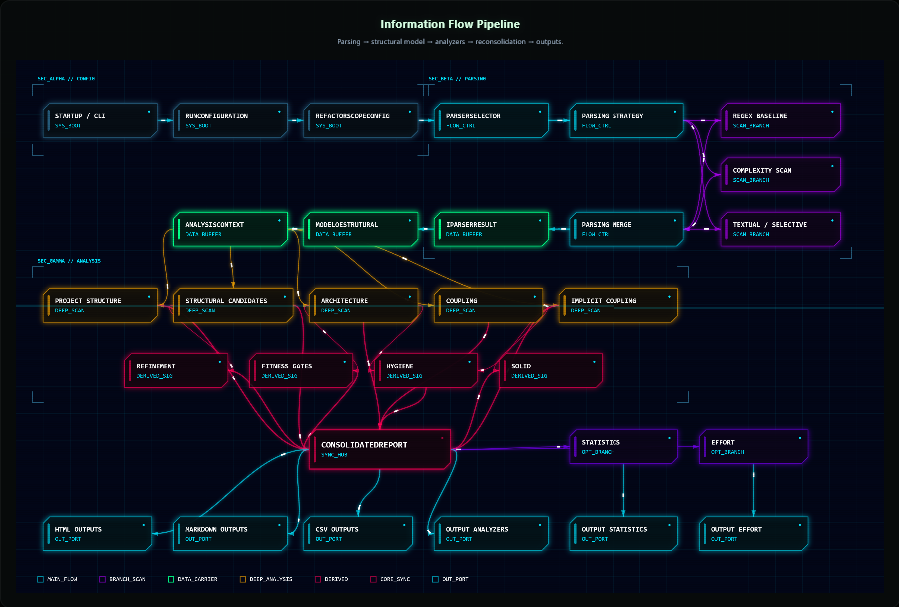
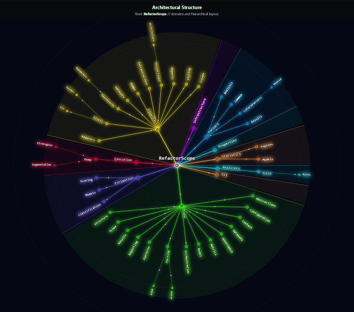

# Architecture and Execution Flow

## 1. The RefactorScope Execution Pipeline

This diagram illustrates the complete lifecycle of an analysis run, from reading the code to generating value for the user. The flow is divided into four isolated stages:

* **Configuration (Input):** Everything starts with `refactorscope.json` and CLI parameters, which define the rules of the game (which folders to ignore, what quality thresholds to apply).
* **Parsing (Extraction):** The heart of performance. Raw code passes through the parsing engines (Regex, Textual, or Hybrid). The goal here is not to compile, but to extract a clean, agnostic **Structural Model** (types, namespaces, and references).
* **Analysis (Intelligence):** With the model in hand, the *Analyzers* step in. They run in parallel to validate layer isolation, calculate metrics (A/I/D), detect implicit coupling, and apply probability heuristics to hunt down dead code. The result of this phase is the emission of the *RDI* (Effort Estimation).
* **Export (Output):** Processed data is translated into high-value artifacts. The system generates Interactive Dashboards (HTML) for visual exploration, Markdown reports for quick PR audits, and JSON *dumps* ready to feed BI tools or AI reviews.

---

## 2. Architectural and Domain Tree

This view details the physical and logical taxonomy of the project. RefactorScope was designed with a strict separation of concerns, ensuring that the analysis engine does not depend on output interfaces.

* **Core & Model:** The center of the system. It contains the main abstractions, the structural data model, and the context definitions that flow throughout the application. No parser-specific business rules reside here.
* **Parsers & Analyzers:** Where extraction and validation happen. Modular directories indicate that new reading engines or new SOLID rules can be plugged in without altering the rest of the codebase.
* **Estimation & Metrics:** Modules dedicated to advanced heuristics. They isolate the mathematical complexity of calculating the *Refactor Difficulty Index (RDI)* and Robert C. Martin's architectural stability.
* **Exporters & CLI:** The edge of the system. The CLI manages user interaction via the terminal (Spectre.Console), while *Exporters* deal purely with formatting, whether generating stylized CSS for dashboards or serializing data for external analysis.